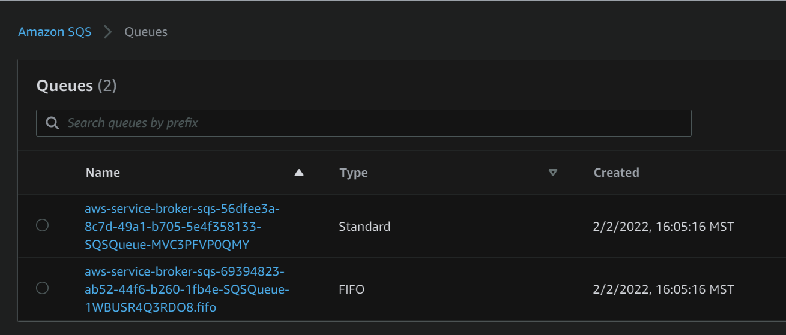

# Example AWS EKS with AWS Service Broker and Flux
This repository contains an example implementation of AWS EKS paired with an expanded toolchain for EKS including AWS Service Broker and Flux.

## Setup
This repository can be stood up with the following steps, when stood up this repository will setup the following infrastructure components:
* AWS VPC with Private and Public Routes and a NAT for private instances
* AWS EKS Cluster with Encryption, Logging, Public/Private Network Routes, and a Managed Node Group
* TBD
* TBD

To setup this infrastructure in your AWS account execute the following steps:
1. From the main project directory navigate to the `terraform` folder via `cd terraform/`.
2. Run `terraform apply` to build your infrastructure, this will take around 15-20 minutes for Terraform to complete.
3. Once complete we want to update our Kube Config file, this can be done with the command `aws eks update-kubeconfig --name ex-terraform`.
4. At this point we want to verify that we have Kubectl connectivity, this can be done via `kubectl get nodes` where we should see a healthy Node available.
5. From here we need to update the `aws-auth` config map as described [here](https://docs.aws.amazon.com/eks/latest/userguide/add-user-role.html). This can be done manually via the `kubectl edit configmap aws-auth -n kube-system` command, and edit it to add your users/roles/groups that need access to the cluster.
6. Once applied, we can setup Flux. To do this we're going to need to create a Personal Access Token as described [here](https://docs.github.com/en/authentication/keeping-your-account-and-data-secure/creating-a-personal-access-token).
7. Once we create the token we then need to provide it to Terraform, one method is through Environment Varialbes as described [here](https://registry.terraform.io/providers/fluxcd/flux/latest/docs/guides/github) where we are setting both our username and token values via the command: `export TF_VAR_github_owner=<owner> && export TF_VAR_github_token=<token>`.
8. We need credentials for the AWS Service Broker User, suggested privileges can be found [here](https://github.com/awslabs/aws-servicebroker/blob/main/docs/install_prereqs.md). Once created we'll need to create an Access Key Id and Secret Key for that user for the next step.
9. Create a secret for the AWS Service Broker to use to create infrastructure with the command `kubectl create secret generic aws-sb -n aws --from-literal=secretkey=<KEY> --from-literal=accesskeyid=<TOKEN>`
10. Follow pre-requisite steps [here](https://github.com/awslabs/aws-servicebroker/blob/main/docs/install_prereqs.md).
11. Now we need to go to the Flux directory via the command `cd ../terraform-eks-flux/`.
12. Run `terraform apply` to initialize the Flux repository and setup Flux on the cluster which will.
13. At this point we want to unzip the additional YAML files into the `dev-elk/flux-system` directory created in the previous step and then commit and push those. Then Flux will automatically sync to that repository and should start setting up AWS Service Broker, ElasticSearch, Kibana, and then finally the AWS S3 Bucket and SQS Queues specified in the YAMLs.

## Validation
At the end of executing the above steps you should have an EKS cluster with ELK deployed in it, AWS Service Broker, and Flux which are provisioning Kubernetes objects and also AWS Objects.

You should see two SQS queues (one FIFO one not), like the below image along with an S3 bucket. If you delete these objects from the Flux repo and commit and push or from Kubernetes itself they will automatically be removed from AWS as well.

